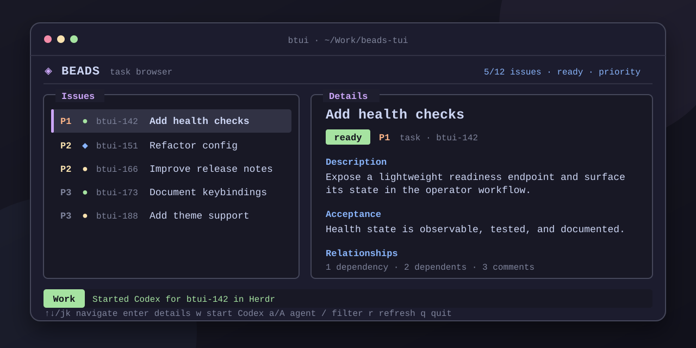

<div align="center">

# btui

### Browse Beads at speed. Start an agent with one key.

A fast, human-friendly terminal interface for exploring [Beads](https://github.com/gastownhall/beads) issues and turning ready work into isolated agent sessions.

[](https://github.com/AndreasDellrud/beads-tui/releases/latest)
[](https://github.com/AndreasDellrud/beads-tui/actions/workflows/ci.yml)
[](https://www.rust-lang.org/)
[](LICENSE)



</div>

## Why btui?

| | |
|---|---|
| **Instant browsing** | Navigate pre-rendered issue summaries without waiting for `bd show` on every selection. |
| **Complete context** | Open descriptions, acceptance criteria, comments, dependencies, and dependents in a dedicated issue screen. |
| **Agent-ready work** | Press `w` to start the selected bead with Codex or Claude Code using Beads as the canonical task source. |
| **Safe isolation** | Inside [Herdr](https://herdr.dev), every managed session gets its own branch-backed Git worktree. |

`btui` stays deliberately small: it invokes the installed `bd` CLI with `--readonly`, consumes supported JSON output, and never becomes a second task database.

## Install

### Prebuilt Linux binary

Download the archive and checksum for the current version from [GitHub Releases](https://github.com/AndreasDellrud/beads-tui/releases/latest), then:

```bash
sha256sum --check btui-*.tar.gz.sha256
tar -xzf btui-*.tar.gz
install -Dm755 btui-*/btui ~/.local/bin/btui
```

### From source

Requires Rust 1.88 or newer:

```bash
git clone https://github.com/AndreasDellrud/beads-tui.git
cd beads-tui
cargo install --path . --locked
```

## Quick start

Run `btui` from any directory where `bd` can discover a Beads workspace:

```bash
cd your-beads-project
btui
```

You only need `bd` on `PATH` to browse. Starting work sessions additionally requires at least one supported agent executable:

- [Codex](https://developers.openai.com/codex/cli/) via `codex`
- [Claude Code](https://docs.anthropic.com/en/docs/claude-code/overview) via `claude`
- optionally, [Herdr](https://herdr.dev) for isolated managed worktrees

## Controls

| Key | Action |
|---|---|
| `↑` / `↓`, `j` / `k` | Navigate issues or scroll the current detail view |
| `Enter` | Open an issue or follow the selected relationship |
| `Tab` / `Shift-Tab` | Select relationships in the issue screen |
| `1` / `2` / `3` | Show active, ready, or closed issues |
| `s` | Cycle priority, updated, and created sorting |
| `/` / `x` | Filter issues / clear the filter |
| `w` / `W` | Start work / force a foreground agent session |
| `a` / `A` | Select the next / previous installed agent |
| `r` | Refresh in the background |
| `Esc` / `Backspace` | Dismiss an error or return to the browser |
| `q` | Quit |

The mouse wheel scrolls the pane beneath the pointer. `Page Up` and `Page Down` move through longer previews and issue bodies without changing the selected issue.

## From bead to work session

```text
select a ready bead ── w ──> validate eligibility ──> launch selected agent
                                                   ├─ Herdr: isolated worktree
                                                   └─ terminal: foreground handoff
```

The agent receives the bead ID—not a copied task description—and is instructed to:

1. Read `AGENTS.md` and repository instructions.
2. Retrieve the canonical task, dependencies, comments, and acceptance criteria from Beads.
3. Stop if the task is blocked; otherwise claim it and create a focused branch.
4. Implement, validate, and update Beads as appropriate.

Closed, blocked, and deferred beads are rejected before launch. Foreground sessions temporarily release the terminal and restore `btui` when the agent exits. Herdr sessions preserve live login, trust, confirmation, timeout, and focus failures for inspection instead of silently deleting useful state.

The active agent is visible in the footer and saved to `$XDG_CONFIG_HOME/btui/config.toml`, falling back to `~/.config/btui/config.toml`. Executable detection does not imply authentication; first-run setup remains an explicit decision in the launched agent.

## Designed for responsive browsing

- Browser previews render directly from `bd list` data.
- Extended issue details load in the background and are cached by identity and freshness.
- Nearby relationships warm concurrently so following one often feels immediate.
- Independent, bounded viewports keep long lists and issue bodies under control.
- A lightweight Beads revision check refreshes external changes without repeatedly running the heavier list command.
- Wide terminals use side-by-side panes; narrow terminals stack them automatically.

## Project boundaries

`btui` does not create, edit, claim, close, or synchronize Beads issues itself. Any mutation happens later inside the visible agent session. It does not read Dolt internals or `.beads/issues.jsonl`.

The installed `bd` executable and its JSON output are authoritative. Agent process control stays behind an executor-neutral task-to-session boundary so additional adapters can be added without rewriting selection or lifecycle policy.

## Development

```bash
./scripts/validate
```

The validation script runs formatting checks, Clippy with warnings denied, and the test suite. GitHub Actions runs the same boundary on pushes and pull requests. Release construction and publication are documented in [docs/releasing.md](docs/releasing.md).

For deeper context, see the [product boundaries](docs/product.md), [architecture](docs/architecture.md), and [project knowledge index](docs/index.md). Live work is tracked only in Beads (`bd ready`, `bd list`).

## License

[MIT](LICENSE) © Andreas Dellrud
